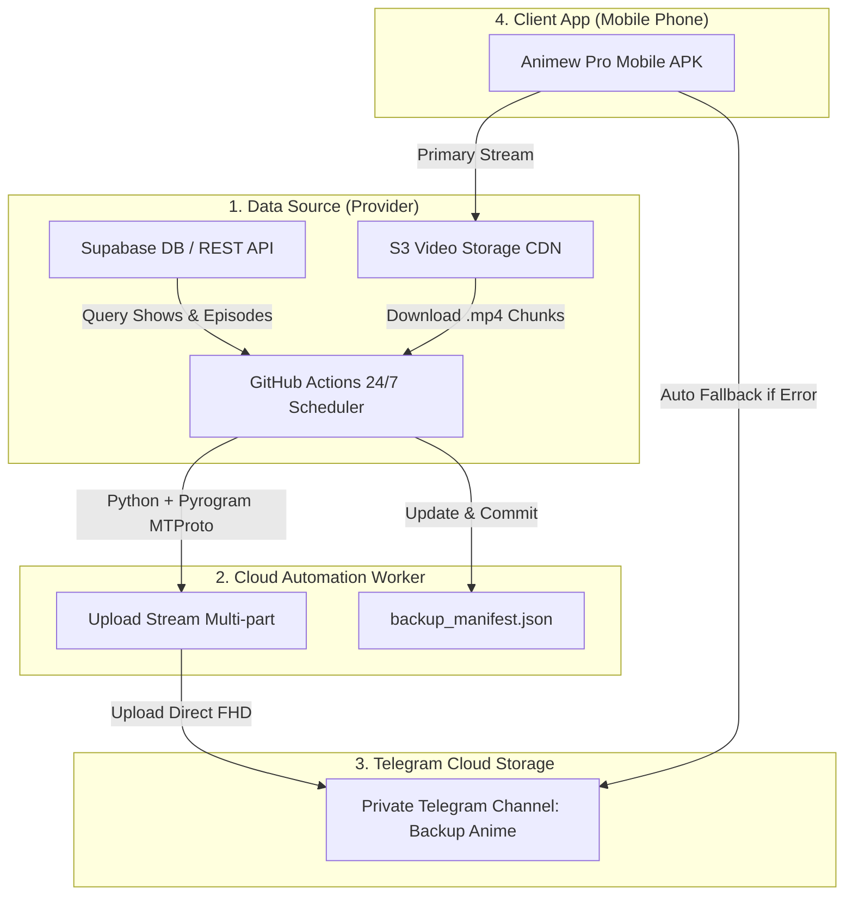

# 📚 ឯកសារស្ថាបត្យកម្មប្រព័ន្ធ Auto Backup to Telegram (Animew Pro)

ឯកសារនេះរៀបរាប់អំពី **រចនាសម្ព័ន្ធ (System Architecture)**, **បច្ចេកវិទ្យាដែលបានប្រើប្រាស់**, និង **របៀបដំណើរការទាំងស្រុង** នៃប្រព័ន្ធ **Auto Backup Anime Videos to Telegram Cloud** តាមរយៈ **GitHub Actions**។

---

## 🏛️ ១. ស្ថាបត្យកម្មទូទៅ (System Architecture)



---

## 📂 ២. រចនាសម្ព័ន្ធឯកសារក្នុងគម្រោង (Project Directory Structure)

```text
AnimewPro/
├── .github/
│   └── workflows/
│       └── auto_backup.yml      # GitHub Actions Scheduler (រត់រៀងរាល់ ១ ម៉ោងម្តង)
├── android/                     # Native Android Project (Capacitor wrapper)
├── www/                         # Compiled Web Assets សម្រាប់ Android App
│   └── index.html
├── backup_manifest.json         # បញ្ជីតាមដានភាគដែលបាន Backup រួច (JSON Database)
├── backup_to_telegram.py        # Python Script មេ សម្រាប់ Auto Download & Upload
├── index.html                   # Mobile Streaming Web App (ជាមួយ UI 3 ជួរ & Fallback Player)
├── requirements.txt             # បញ្ជី Python Packages (pyrogram, tgcrypto, httpx)
├── capacitor.config.json        # Capacitor Android App Configuration
└── README.md                    # ឯកសារណែនាំទូទៅ
```

---

## ⚙️ ៣. ដំណើរការលម្អិតនៃ Script (`backup_to_telegram.py`)

1. **ទាញយកទិន្នន័យពី Supabase Database**:
   - អានបញ្ជីរឿងទាំងអស់ (`/rest/v1/shows`)
   - អានបញ្ជីភាគ និង Link វីដេអូទាំងអស់ (`/rest/v1/episodes?video_url=not.is.null`)
2. **ប្រព័ន្ធការពារការ Upload ត្រួតគ្នា (Duplicate Prevention)**:
   - ពិនិត្យប្រៀបធៀប `episode_id` នីមួយៗជាមួយឯកសារ `backup_manifest.json`
   - ប្រសិនបើភាគណាមានក្នុង Manifest រួចហើយ -> **រំលងចោល (Skip)**
   - ប្រសិនបើជាភាគថ្មី -> **បញ្ចូលក្នុងបញ្ជីរង់ចាំ (Pending Queue)**
3. **ទាញយក និង Upload វីដេអូ (Stream Download & MTProto Upload)**:
   - ទាញយក File `.mp4` មកកាន់ Temporary Storage ដោយប្រើ `httpx.stream`
   - Upload ចូល Telegram Channel តាមរយៈ **Pyrogram (MTProto Protocol)** ដែលអាច Upload វីដេអូបានដល់ **2,000 MB (2GB)** ក្នុងល្បឿនលឿន
   - កែសម្រួល `pyrogram.utils.MIN_CHANNEL_ID = -100999999999999` ដើម្បីគាំទ្រ **64-bit Telegram Channel ID**
4. **កត់ត្រាទិន្នន័យ (State Persistence)**:
   - រាល់ពេល Upload ចប់ ១ ភាគ វានឹងកត់ត្រា `telegram_message_id`, `file_id`, និង `file_size_mb` ចូលក្នុង `backup_manifest.json` ភ្លាមៗ។

---

## 🤖 ៤. ដំណើរការលើ GitHub Actions (`auto_backup.yml`)

* **កាលវិភាគ (Trigger Schedule)**:
  - `cron: '0 * * * *'` : ដំណើរការរៀងរាល់ ១ ម៉ោងម្តងដោយស្វ័យប្រវត្តិ
  - `workflow_dispatch` : អនុញ្ញាតឱ្យចុច Run ដោយដៃលើ GitHub UI បានគ្រប់ពេល
* **បរិស្ថានដំណើរការ (Environment & Secrets)**:
  - ដំណើរការលើ `ubuntu-latest` ជាមួយ `Python 3.11`
  - ប្រើប្រាស់ GitHub Encrypted Secrets៖
    - `TG_API_ID` : Telegram Developer API ID
    - `TG_API_HASH` : Telegram Developer API Hash
    - `TG_BOT_TOKEN` : Bot Token ពី @BotFather
    - `TG_CHANNEL_ID` : Telegram Private Channel ID (ឧ. `-100xxxxxxxxxx`)
* **Auto Commit Manifest**:
  - បន្ទាប់ពី Backup ចប់ GitHub Action នឹងធ្វើការ Auto `git commit` និង `git push` បញ្ជី `backup_manifest.json` ថ្មីចូលទៅក្នុង Repository ដោយស្វ័យប្រវត្តិ។

---

## 📱 ៥. ប្រព័ន្ធ Smart Fallback លើ App (`index.html`)

* **Primary Mode**: Player ចាក់វីដេអូធម្មតាពី Server ដើមរបស់ Provider
* **Fallback Mode (`player.onerror`)**:
  - ប្រសិនបើ Server ដើមគាំង (404, 503, Token Expired, ឬដាច់ Network)
  - Player នឹងចាប់ Error ក្នុងរយៈពេល **0.8s** រួចប្តូរទៅកាន់ Backup Mirror ដោយស្វ័យប្រវត្តិ
  - បង្ហាញ Alert Banner និងប៊ូតុង **"សាកល្បងឡើងវិញ (Retry Server)"** ជូនអ្នកទស្សនា។

---

## 🔒 ៦. សុវត្ថិភាពទិន្នន័យ (Security Highlights)

1. **Tokens & Secrets**: រាល់ Telegram Bot Token, API ID, និង API Hash ត្រូវបានការពារដោយ **GitHub Secrets (Libsodium Encryption)** គ្មាននរណាម្នាក់អាចមើលឃើញជាសាធារណៈឡើយ។
2. **Private Storage**: វីដេអូទាំងអស់ត្រូវបានរក្សាទុកក្នុង **Private Telegram Channel** មានតែ Bot និង Owner ប៉ុណ្ណោះដែលអាចគ្រប់គ្រងបាន។
