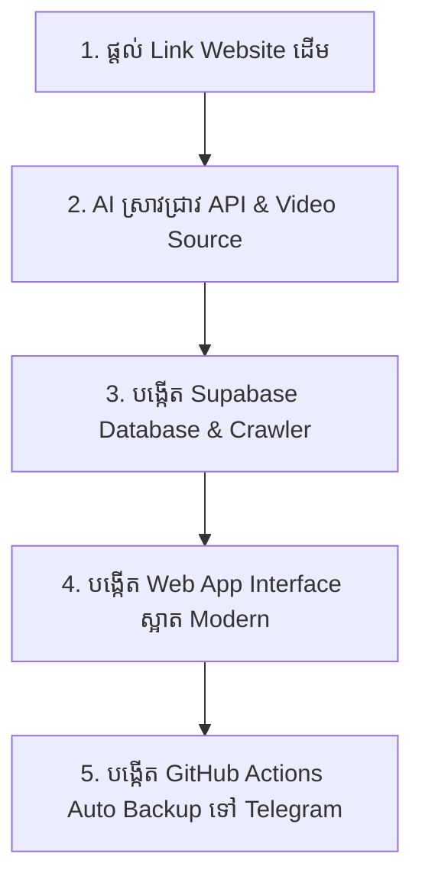

# 🎬 មគ្គុទ្ទេសក៍៖ របៀបប្រាប់ AI ឱ្យបង្កើត Web មើលរឿង Free ពី Website ថ្មីៗ
> **(Prompt & Workflow Guide for Cloning Any Streaming Website)**

ឯកសារនេះត្រូវបានបង្កើតឡើងដើម្បីឱ្យអ្នកងាយស្រួល **Copy-Paste ឬយកទៅប្រើប្រាប់ AI (ENI)** នៅពេលក្រោយ ប្រសិនបើអ្នកមាន Website មើលរឿង/Anime ផ្សេងទៀត ហើយចង់ឱ្យ AI បង្កើតជា **Web App ឬ Mobile App មើលរឿង Free និងស្អាតដូច Animew Pro**។

---

## 📌 ផ្នែកទី ១៖ ព័ត៌មានសំខាន់ៗដែលត្រូវត្រៀម (Before Asking AI)

មុនពេលផ្ញើសួរ AI អ្នកគ្រាន់តែផ្តល់ព័ត៌មាន ៣ ចំណុចនេះ៖
1. **Link Website ដើម** (ឧ. `https://example-movie.com`)
2. **Link Video គំរូ ឬប្រភេទ Player** (ឧ. MP4 link, M3U8 HLS, ឬ Iframe Embed)
3. **មុខងារដែលចង់បាន** (UI Dark Mode, មុខងារស្វែងរក, ចាំភាគដែលធ្លាប់មើល, Auto Backup ទៅ Telegram...)

---

## 🚀 ផ្នែកទី ២៖ Template Prompts (អាច Copy យកទៅប្រើបានភ្លាមៗ)

### 🔹 Prompt ទី ១៖ ឱ្យ AI វិភាគ និងទាញយក API / Video Source ពី Web នោះ
> *"ខ្ញុំមាន Website មើលរឿងមួយនេះ: `[ដាក់ Link Website នៅទីនេះ]`។*
> *ជួយ Inspect និង Reverse Engineer មើលថាតើ Web នេះប្រើ API អ្វីដើម្បីទាញយកបញ្ជីរឿង (Show list), ព័ត៌មានភាគ (Episodes) និង Video Direct Stream Link (MP4/M3U8) ដោយរបៀបណា? ជួយសរសេរ Script Python មួយដើម្បីសាកល្បង Crawl ទិន្នន័យ 1 រឿងគំរូ។"*

---

### 🔹 Prompt ទី ២៖ ឱ្យ AI បង្កើត Frontend Web App ស្អាតកម្រិត Premium (ដូច Animew Pro)
> *"ជួយបង្កើត Single-Page Web App (HTML, CSS, JS) សម្រាប់មើលរឿងដោយទាញទិន្នន័យពី `[ឈ្មោះ Website ឬ Supabase]` ដោយមានលក្ខណៈពិសេសដូចខាងក្រោម៖*
> 1. *Design: Modern Dark Theme (Glassmorphism, Vibrant Accents, Mobile-First ដូច Netflix/Anime App)*
> 2. *Grid Layout: បង្ហាញ Poster 3 ជួរលើទូរស័ព្ទ (Compact Card, Badge បង្ហាញចំនួនភាគ និងកម្រិតច្បាស់)*
> 3. *មុខងារ Filter & Search: ស្វែងរកតាមឈ្មោះ, Filter រឿងទោល/រឿងភាគ, និង Tab 🕒 'ទើបមើល (Recent)'*
> 4. *Video Player: Sticky Video Player ខាងលើ, ប៊ូតុងជ្រើសរើសភាគ (Episode Pills), ចងចាំវិនាទីដែលមើល និងភាគដែលបានមើលរួច (Local Storage)*
> 5. *Notification Drawer: ផ្ទាំងបង្ហាញភាគដែលទើប Update ថ្មីៗ*"*

---

### 🔹 Prompt ទី ៣៖ ឱ្យ AI បង្កើត Database (Supabase) & Auto Scraper
> *"ជួយរៀបចំ Database Schema លើ Supabase (តារាង `shows` និង `episodes`) និងសរសេរ Python Script មួយដើម្បី Crawl រឿងទាំងអស់ពី `[ដាក់ Link Web]` មកបញ្ចូលក្នុង Supabase ដោយស្វ័យប្រវត្តិ (Auto Update ពេលមានភាគថ្មី)។"*

---

### 🔹 Prompt ទី ៤៖ ឱ្យ AI បង្កើតប្រព័ន្ធ Auto Backup វីដេអូទៅ Telegram Channel
> *"ខ្ញុំចង់បង្កើតប្រព័ន្ធ Auto Backup វីដេអូពី Database ទៅកាន់ Telegram Channel ដោយប្រើ GitHub Actions ដំណើរការរៀងរាល់ ៦ ម៉ោងម្តង៖*
> 1. *ប្រើ `pyrofork` ឬ MTProto Bot ក្នុងការ Upload វីដេអូទំហំធំ (រហូតដល់ 2GB)*
> 2. *រក្សាទុក `backup_manifest.json` លើ GitHub ដោយស្វ័យប្រវត្តិកុំឱ្យ Download ជាន់ភាគចាស់*
> 3. *រៀបចំ `.github/workflows/auto_backup.yml` ឱ្យមាន Real-time Log និង `if: always()` សម្រាប់ Save Manifest*"*

---

## 🛠️ ផ្នែកទី ៣៖ គន្លឹះស្រង់យក Video Source ដោយខ្លួនឯង (Quick DevTools Tips)

ប្រសិនបើអ្នកចង់រកមើលថា Web នោះលាក់ Video Link នៅត្រង់ណា៖
1. បើក Website នោះលើ **Google Chrome / Brave Browser**
2. ចុច **F12** (ឬ Right-click > **Inspect**) រួចចូលទៅ Tab **`Network`**
3. ក្នុងប្រអប់ Filter វាយពាក្យ៖
   - `m3u8` (សម្រាប់ HLS Live Streaming)
   - `mp4` (សម្រាប់ Direct Video Link)
   - `api` ឬ `v1` (សម្រាប់ JSON Data)
4. ចុច Play វីដេអូនៅលើ Web នោះ អ្នកនឹងឃើញ URL នៃវីដេអូធ្លាក់មកក្នុង Network Tab ភ្លាម!
5. **Copy Link នោះផ្ញើមកឱ្យ AI** នោះ AI នឹងដឹងពីទម្រង់ Server ហើយរៀបចំកូដឱ្យអ្នកយ៉ាងលឿនបំផុត។

---

## 📋 សង្ខេបលំដាប់លំដោយការងារ (Standard Workflow)

