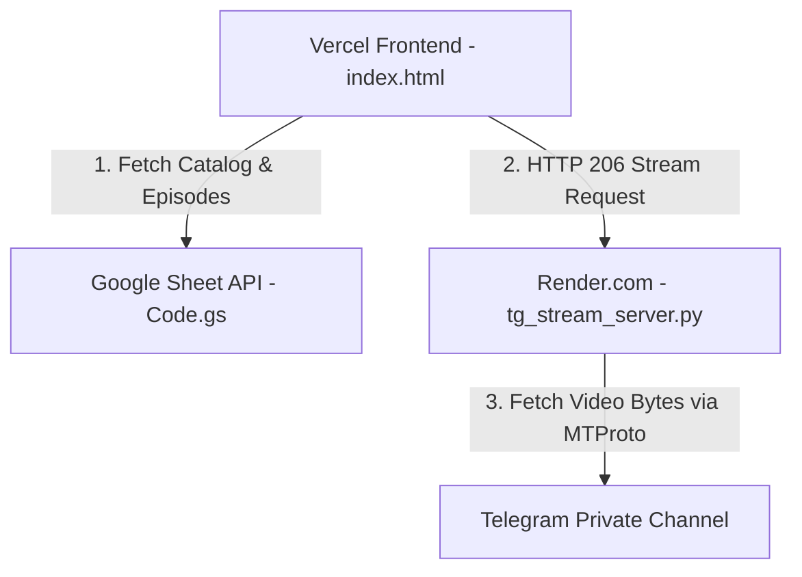

# 🚀 មគ្គុទ្ទេសក៍ដំឡើងប្រព័ន្ធ Telegram Cloud Video Streaming (Vercel + Render + Google Sheet)

ឯកសារនេះរៀបរាប់អំពី **របៀបដំឡើងប្រព័ន្ធ Vercel + Render.com ឱ្យដំណើរការ 100% 24/7 ឥតគិតថ្លៃ** សម្រាប់កម្មវិធីទស្សនារឿងភាគ **DramaFlixHD / AnimewPro**។

---

## 🏛️ ស្ថាបត្យកម្មប្រព័ន្ធ (Architecture Overview)



1. **Vercel**: ផ្ទុក **Frontend Web App (`index.html`)** រត់លើ HTTPS ល្បឿនលឿន។
2. **Google Sheet (`Code.gs`)**: ធ្វើជា **Database** ផ្ទុកបញ្ជីរឿង, ភាគ, និង `telegram_message_id`។
3. **Render.com (`tg_stream_server.py`)**: ធ្វើជា **Streaming Engine** 24/7 សម្រាប់ Stream វីដេអូ 1080p ត្រង់ពី Telegram Channel។

---

## 🛠️ ជំហានទី ១: Deploy Telegram Stream Server លើ Render.com (ឥតគិតថ្លៃ ១០០%)

1. ចូលទៅកាន់ **[Render.com](https://render.com)** រួចចុច Register/Login (អាចប្រើ GitHub Account បាន)។
2. ចុចប៊ូតុង **New +** -> ជ្រើសរើស **Web Service** (ឬ Blueprint)។
3. Connect ជាមួយ GitHub Repository របស់បង ៖ `sheakmeng/AnimewPro` (ឬ `DramaFlixFHD`)។
4. កំណត់ Settings ដូចខាងក្រោម ៖
   - **Name**: `dramaflix-stream-server`
   - **Environment**: `Python 3`
   - **Region**: `Singapore` (ឬដែនដីជិតបំផុត)
   - **Build Command**: `pip install -r requirements.txt`
   - **Start Command**: `python tg_stream_server.py`
5. ត្រង់ផ្នែក **Environment Variables** (គន្លឹះសំខាន់) ៖
   - `TG_API_ID` = `20360418`
   - `TG_API_HASH` = `3990d0d3cc6c5bd81c93a13cd5e3a311`
   - `TG_BOT_TOKEN` = `8830193594:AAFVOnaInthtZGt9zYNWjWbA1lfwyhroHPk`
   - `TG_CHANNEL_ID` = `-100XXXXXXXXXX` (ID នៃ Channel `https://t.me/+ZR-LU1YDhgUwMTVl` របស់បង)
6. ចុច **Create Web Service**! បន្ទាប់ពី Build ចប់ បងនឹងទទួលបាន **HTTPS Web Link** ថេរមួយ ឧទាហរណ៍ ៖
   `https://dramaflix-stream-server.onrender.com`

---

## 🛠️ ជំហានទី ២: Add Telegram Bot ជា Admin ក្នុង Telegram Channel

1. បើក Telegram App រួចចូលទៅកាន់ Channel របស់បង ៖ `https://t.me/+ZR-LU1YDhgUwMTVl`
2. ចុចលើឈ្មោះ **Channel Settings** -> ជ្រើសរើស **Administrators**
3. ចុច **Add Admin** -> ស្វែងរក Bot របស់បង `@your_bot_username`
4. ផ្តល់សិទ្ធិ Admin រួចចុច **Save**!

---

## 🛠️ ជំហានទី ៣: ភ្ជាប់ Stream Server Link ចូលក្នុង Vercel App

1. បើកឯកសារ `index.html` និង `www/index.html` ក្នុង VS Code។
2. ត្រង់ជួរទី **3803** កែប្រែ `defaultTgServer` ទៅជា Link Render របស់បង ៖
   ```javascript
   const defaultTgServer = "https://dramaflix-stream-server.onrender.com";
   ```
3. ធ្វើការ `git commit` និង `git push` ចូលទៅកាន់ GitHub -> Vercel នឹង Auto Update ដោយស្វ័យប្រវត្តិ!

---

## 🛠️ ជំហានទី ៤: ពិនិត្យ Google Sheet ("Manifest")

1. បើក Google Sheet របស់បងដែលបានភ្ជាប់ជាមួយ `Code.gs`
2. ប្រាកដថា Tab មានឈ្មោះថា **`Manifest`**
3. ប្រាកដថាមាន Column ៖
   - `ep_id`: ឧ. `ep_dramabite_101`
   - `show_id`: ឧ. `show_dramabite_1`
   - `show_title`: ឈ្មោះរឿង
   - `episode_number`: លេខភាគ (1, 2, 3...)
   - `telegram_message_id`: **លេខ Message ID នៃវីដេអូក្នុង Telegram Channel** (ឧ. `45`, `46`, `47`)
   - `poster_url`: Link រូបគម្រប់

---

## 🎉 រួចរាល់! 
ឥឡូវនេះ Mini App របស់បងលើ **Vercel** នឹងទាញ Data ពី **Google Sheet** មកបង្ហាញ និងទាញ Video ពី **Telegram Cloud** តាមរយៈ **Render Stream Engine** មកចាក់យ៉ាងរលូនកម្រិត 1080p FHD!
